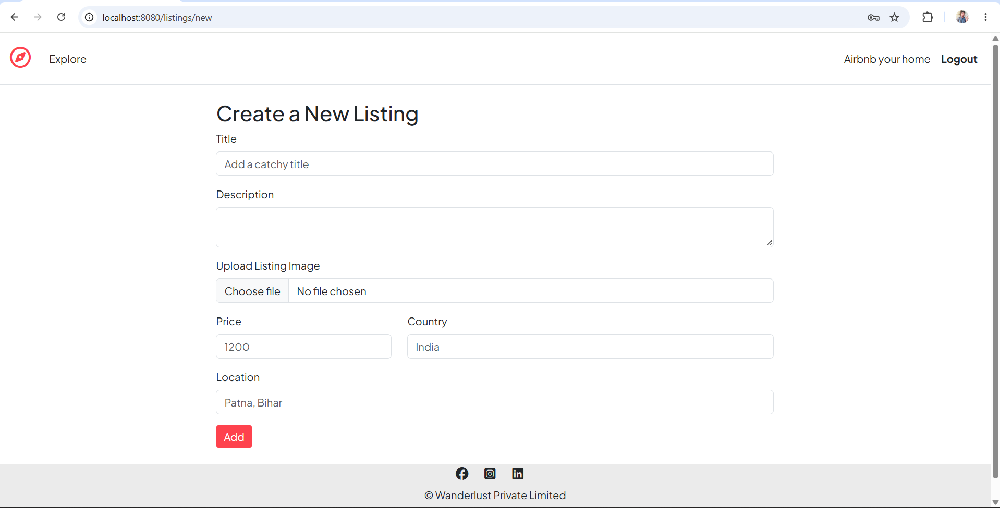
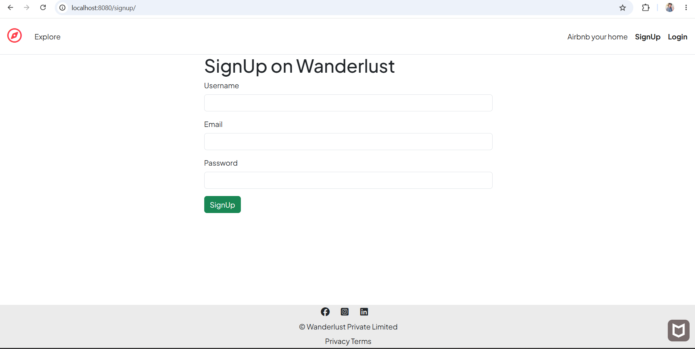
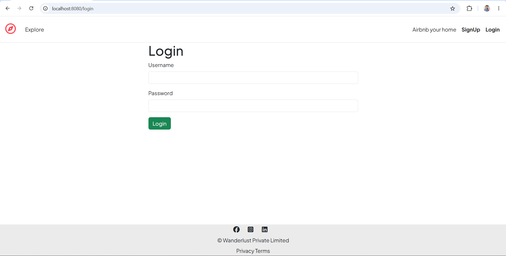
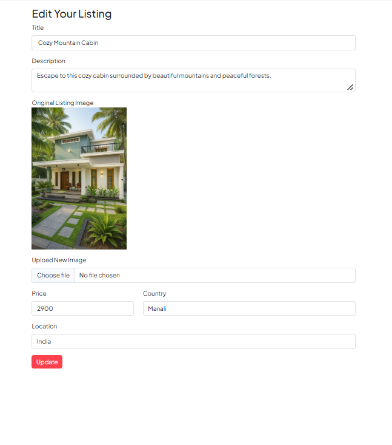
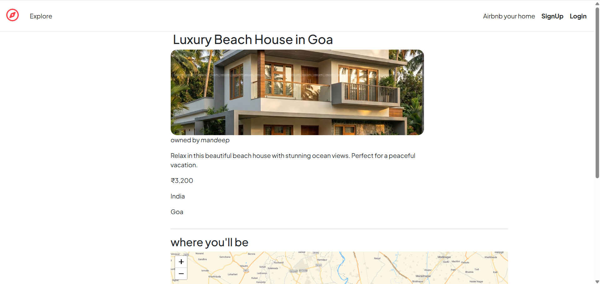
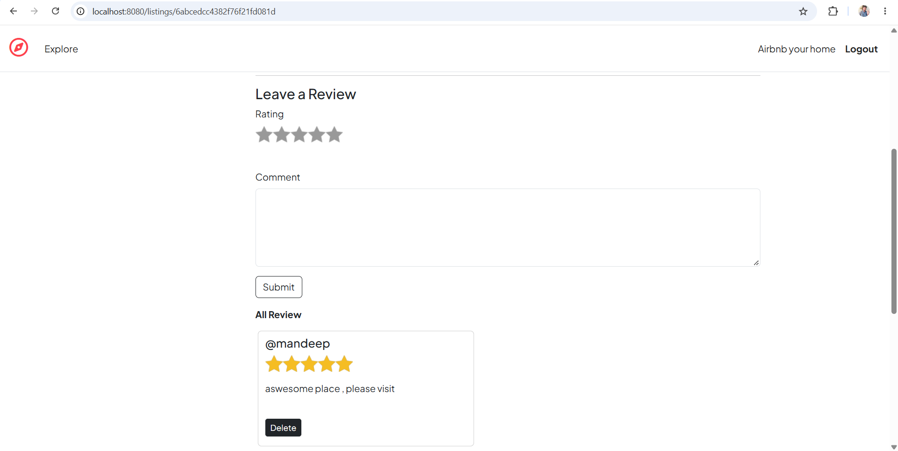
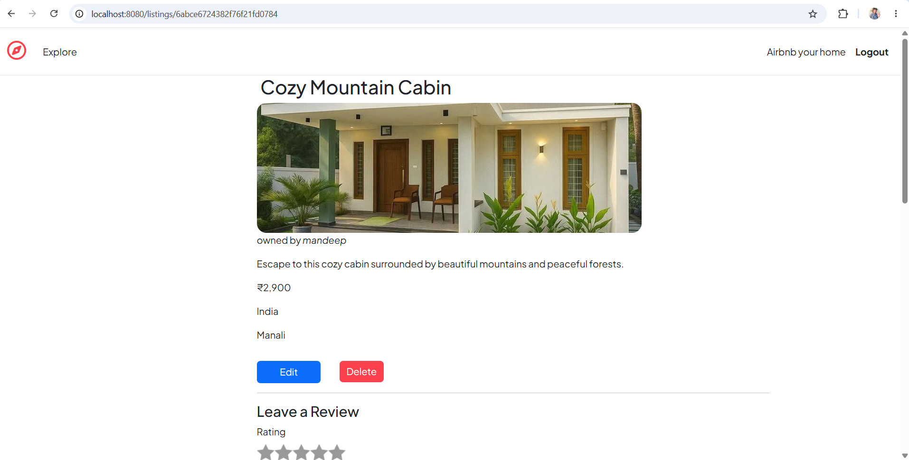
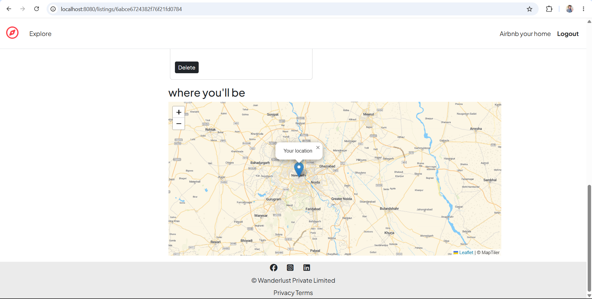

# 🏡 Wanderlust — Airbnb Clone

Wanderlust is a full-stack Airbnb-inspired web application where users can explore property listings, view listing details, create new listings, add reviews, and manage their accounts.

The project is built using **Node.js, Express.js, MongoDB, EJS, and Bootstrap** with authentication and cloud-based image storage.

---

## 📸 Screenshots

### 🏠 Home / Listings Page


### ➕ Create New Listing



### 🔐 Login / Signup





### edit page



### review_page



### rating



### your listing



### map




---

## ✨ Features

- 🔐 User authentication with Passport.js
- 📝 User registration and login
- 🏠 Browse property listings
- 🔍 View detailed information about each listing
- ➕ Create new listings
- ✏️ Edit and delete your own listings
- ⭐ Add and delete reviews
- 🖼️ Upload listing images using Cloudinary
- 🗺️ Map integration for listing locations
- 💬 Flash messages for user feedback
- 📱 Responsive design for desktop and mobile devices
- 🔒 Authorization to protect user-specific actions

---

## 🛠️ Tech Stack

### Frontend

- HTML
- CSS
- Bootstrap
- EJS
- EJS-Mate
- JavaScript

### Backend

- Node.js
- Express.js
- Passport.js
- Express Session
- Method Override

### Database

- MongoDB
- Mongoose
- MongoDB Atlas

### Other Tools & Services

- Cloudinary
- Leaflet
- MapTiler
- Git
- GitHub


## ⚙️ Installation & Setup

### 1. Clone the repository

```bash
git clone https://github.com/Mandeep112-prog/Wanderlust-airbnb-.git
```

### 2. Navigate to the project

```bash
cd Wanderlust-airbnb-
```

### 3. Install dependencies

```bash
npm install
```

### 4. Create `.env` file

Create a `.env` file in the root directory and add your environment variables:

```env
ATLASDB_URL=your_mongodb_atlas_connection_string

SECRET_KEY=your_session_secret

CLOUDINARY_CLOUD_NAME=your_cloudinary_cloud_name
CLOUDINARY_KEY=your_cloudinary_api_key
CLOUDINARY_SECRET=your_cloudinary_api_secret

MAP_TOKEN=your_map_token
```

> Never upload your `.env` file to GitHub.

---

## ▶️ Run the Application

Start the application using:

```bash
npm start
```

For development, you can use:

```bash
node app.js
```

The application will run locally at:

```text
http://localhost:8080
```

---

## 🔑 Authentication

Wanderlust uses **Passport.js** for user authentication.

Users can:

- Create an account
- Login
- Logout
- Access protected routes
- Create and manage their own listings
- Add reviews to listings

---

## 🖼️ Image Upload

Listing images are uploaded and stored using **Cloudinary**.

The application uses:

- Cloudinary
- Multer
- Multer Storage Cloudinary

This allows listing images to be stored in the cloud instead of the local project directory.

---

## 🗺️ Map Integration

The application uses **Leaflet** and **MapTiler** to display listing locations on an interactive map.

---

## 📱 Responsive Design

The application is designed to work across different screen sizes, including:

- 💻 Desktop
- 💻 Laptop
- 📱 Mobile
- 📱 Tablet

---

## 🚀 Deployment

The application is deployed using **Render**.

### Deployment requirements

- MongoDB Atlas database
- Cloudinary account
- MapTiler API token
- Environment variables configured on Render

---

## 🔮 Future Improvements

Some features that can be added in the future:

- 🔎 Advanced search and filtering
- ❤️ Wishlist functionality
- 💳 Online payment integration
- 📅 Booking and reservation system
- 📧 Email notifications
- 👤 User profile management
- ⭐ Advanced rating system

---

## 👨‍💻 Author

**Mandeep Kumar**

B.Tech — Computer Science & Engineering

### Connect with me

- GitHub: https://github.com/Mandeep112-prog
- LinkedIn: https://www.linkedin.com/in/mandeepkumarr/

---

## 📄 License

This project is created for learning and educational purposes.